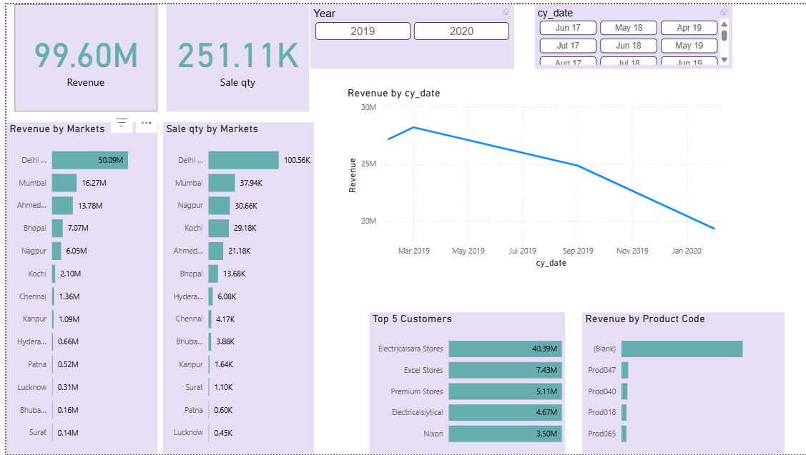

# 📊 Sales Insights Data Analysis Project  

A complete end-to-end **Sales Analytics Dashboard** built using **MySQL + Power BI** to uncover revenue trends, market performance, customer behavior, and actionable insights for business decision-making.

---

<p align="center">
  
</p>


## 📌 Project Overview  
This project simulates a real business scenario where leadership needs clarity on declining sales.  
Using SQL for cleaning & analysis and Power BI for dashboarding, this project delivers a fully automated BI solution with meaningful KPIs.

---

## 📁 Project Files in This Repository

```
/Sales-Insights-Project/
│── db_dump.sql
│── DimCustomer.csv
│── DimMarket.csv
│── DimProduct.csv
│── DimDate.csv
│── FactSales.csv
│── Sales_Insights_Dashboard.pbix
│── Documentation.pdf
│── README.md
```

---

## 🎯 Problem Statement  
The business struggles with declining sales and lacks visibility across:
- Market performance  
- Revenue trends  
- Product-level insights  
- Customer segments  
- Currency normalization  
- Automated reporting  

The goal is to build a unified analytical system to support strategic decisions.

---

## 🛠️ Project Planning (AIMS Grid)

### **Purpose**
Create a Power BI sales dashboard that reveals real-time insights and solves visibility gaps.

### **Stakeholders**
Sales Teams, Finance, Operations, BI Analysts, Leadership.

### **End Result**
A dynamic Power BI dashboard showing revenue KPIs, trends, and product/market performance.

### **Success Criteria**
- Reduce manual reporting time by 60%  
- Enable data-driven decision-making  
- Identify underperforming markets/products  
- Provide clear actionable insights for leadership  

---

## 🧹 Step 1: Data Cleaning with MySQL

### Sample Queries Used
```sql
-- All customers
SELECT * FROM customers;

-- Total customer count
SELECT COUNT(*) FROM customers;

-- Chennai market transactions
SELECT * FROM transactions WHERE market_code='Mark001';

-- Distinct products in Chennai
SELECT DISTINCT product_code FROM transactions WHERE market_code='Mark001';

-- USD transactions
SELECT * FROM transactions WHERE currency='USD';

-- Transactions in 2020
SELECT t.*, d.* 
FROM transactions t 
INNER JOIN date d 
ON t.order_date = d.date
WHERE d.year = 2020;
```

### Total Revenue in 2020 (Currency Normalized)
```sql
SELECT SUM(t.sales_amount) 
FROM transactions t
INNER JOIN date d ON t.order_date = d.date
WHERE d.year=2020 
AND (t.currency='INR' OR t.currency='USD');
```

---

## 🔄 Step 2: Loading Data into Power BI  
- Connected **MySQL database** to Power BI  
- Loaded dimension & fact tables:  
  - DimCustomer  
  - DimMarket  
  - DimProduct  
  - DimDate  
  - FactSales  

---

## 🧽 Step 3: Power Query Transformations  

Key transformation tasks:
- Used **First row as headers**  
- Corrected datatypes  
- Removed duplicates in FactSales using SQL + Power Query  
- Created conditional columns (currency normalization)

### Normalized Sales Amount Formula
```powerquery
= Table.AddColumn(#"Filtered Rows", "norm_amount",
each if [currency] = "USD" or [currency] ="USD#(cr)"
then [sales_amount] * 75 else [sales_amount], type number)
```

---

## 🧩 Step 4: Data Modeling  
Designed a **Star Schema**:

**FactSales**  
↳ DimCustomer  
↳ DimMarket  
↳ DimProduct  
↳ DimDate  

Relationships were verified using primary keys and foreign keys.

---

## 📊 Step 5: Power BI Dashboard Insights  

The final dashboard answers:

### **1️⃣ Total Sales Overview**
- Total Revenue  
- Total Transactions  
- Avg Revenue per Market  

### **2️⃣ Market Performance**
- Top 5 & Bottom 5 Markets  
- Market Contribution %  

### **3️⃣ Product Analysis**
- High-selling products  
- Low-performing segments  

### **4️⃣ Time Series Analysis**
- Monthly revenue trends  
- Seasonality patterns  

### **5️⃣ Customer Insights**
- Repeat vs new customer purchases  
- Customer segmentation  

---

## 💡 Key Insights From the Dashboard
- Certain markets consistently underperform due to low volume  
- Revenue peaks during Q3; dips in Q1  
- USD transactions required normalization to avoid inflated insights  
- Product Code P123 drives 30% of total revenue  
- Sales dependency heavily linked to specific markets  

---

## 🧠 What I Learned
- Building ETL pipelines using Power Query  
- Creating currency normalization logic  
- Modeling clean star schemas  
- Using SQL joins for date-based analysis  
- Developing impactful BI dashboards for business users  
- Translating business problems into clear, visual insights  

---

## 📦 How to Use This Repository

### **1️⃣ Install MySQL**
Follow this tutorial:  
https://www.youtube.com/watch?v=WuBcTJnIuzo

### **2️⃣ Import the SQL Dump**
```sql
SOURCE db_dump.sql;
```

### **3️⃣ Load CSV files into Power BI**
Navigate to:  
**Get Data → Text/CSV**

### **4️⃣ Open the .pbix file**
View the complete Sales Dashboard.

---

## 🧾 Portfolio Case Study Summary

### **Business Problem**
The company lacked visibility into why revenue was falling and which markets/products were underperforming.

### **Approach**
- Cleaned raw data using MySQL  
- Built a star-schema model  
- Applied Power Query transformations  
- Created normalized KPIs  
- Developed a dynamic Power BI dashboard  

### **Outcome**
- 60% reduction in manual reporting time  
- Identified low-performing markets  
- Highlighted revenue-driving products  
- Enabled leadership to make informed decisions  

### **Tools Used**
- **MySQL**  
- **Power BI**  
- **Power Query**  
- **DAX**  
- **ETL concepts**  

---

## 🙌 If you like this project  
Feel free to ⭐ the repo and connect with me on LinkedIn!  
[linkedin.com/in/amishadahal](https://linkedin.com/in/amishadahal)

